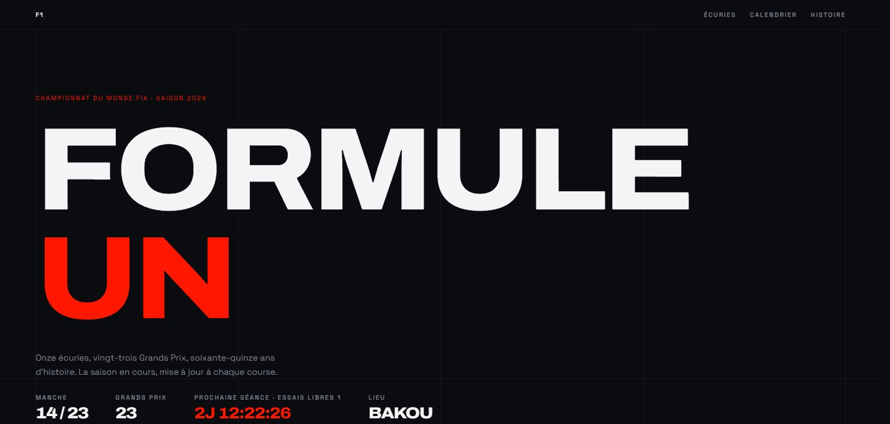

# F1 — Formule 1, saison 2026

Site non officiel sur le championnat du monde de Formule 1 : les écuries de la saison,
le calendrier des 23 Grands Prix avec le tracé de chaque circuit, et l'histoire du
championnat.



En ligne : https://dunandchatellet.fr/f1/

## Qui a écrit quoi

Ce site a été codé avec l'IA (Claude Code). Il fait partie de mon
[portfolio](https://dunandchatellet.fr/projets.html), où il porte la mention « Codé avec l'IA ».

## Les pages

| Page | Contenu |
| --- | --- |
| Accueil | Manche en cours, compte à rebours avant la prochaine séance |
| Écuries | Les 11 écuries de 2026 et leurs pilotes |
| Calendrier | Les 23 Grands Prix, avec le tracé de chaque circuit |
| Histoire | Les grandes époques du championnat, avec deux photos d'archive |

Le site est construit en **plusieurs vraies pages HTML** plutôt qu'avec un routeur côté
navigateur : l'hébergement mutualisé ne permet pas de réécrire les adresses côté serveur,
donc un lien direct vers une sous-page renverrait une erreur 404.

## D'où viennent les données

- [Jolpica-F1](https://jolpi.ca/) : calendrier, classements pilotes et constructeurs.
- [OpenF1](https://openf1.org/) : grille et couleurs des écuries.
- [MultiViewer](https://multiviewer.app/) : géométrie des tracés, figée au moment du build.
- Photos d'archive : fonds Anefo, licence CC0.

Jolpica et OpenF1 sont interrogés par le navigateur du visiteur au chargement de la page.
Si l'un des deux ne répond pas, le site affiche la dernière sauvegarde
(`src/data/season.snapshot.ts`) et le signale.

Les deux sources ne s'accordent pas toujours : le calendrier de Jolpica fait foi.

## Développer

Node.js est nécessaire. Le projet utilise Vite, React 19, Tailwind CSS 4 et Framer Motion.

```bash
npm install
npm run dev          # serveur de développement
npm run build        # vérification TypeScript puis build dans dist/
npm run lint
npm run check        # vérifications de la logique de src/lib
npm run fetch-data   # régénère les tracés et la sauvegarde du calendrier
```

Le site est servi depuis le sous-dossier `/f1/` (`base` dans `vite.config.ts`).

## Mentions

Site non officiel, sans lien avec la Formula One World Championship Limited. Les noms
d'écuries et de Grands Prix sont cités à titre informatif. Aucune image officielle n'est
reproduite.

---

Pierre Dunand-Chatellet — [tous mes projets](https://dunandchatellet.fr/projets.html)
